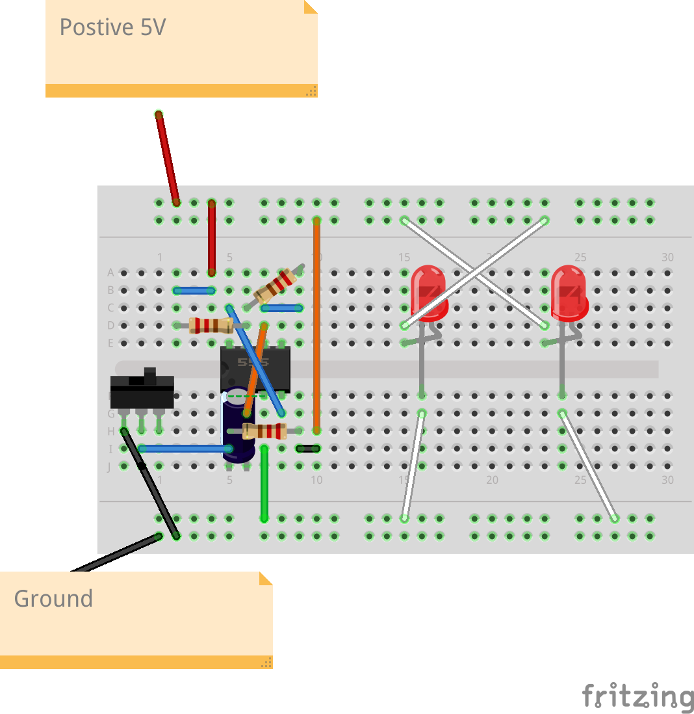

# Sunset_Park
Sunset Park, Brooklyn - On any given Sunday

## Overview

Desk Art

## Table of Contents

- [Features](#features)
- [Materials](#materials)
- [Setup](#setup)
- [Usage](#usage)
- [Contributing](#contributing)
- [License](#license)

## Features

Key features of this breadboard project.

- Fun 
- If you implement this circuit you will have a desk with a flashing set of red  leds
- Just like a drive to Sunset Park - Everyone unloading the cars after grocery shopping - with hazards' on

## Materials

Materials required to replicate the project:

- 555 Timer
- 2 x 220 Ohm R
- 2 x red  LEDs
- Some jumper cables
- 400 point breadboard

(All available at jameco.com or other electronics online stores)

## Setup

How to set up the breadboard project. 

TBD

| LED | Description|
|-----|------------|
| Cathodes | Connect to resistors|
| Anode   | Connect to GND|

## BreadBoard pics
(See /images for pdf, fzz and others)

## Movie
